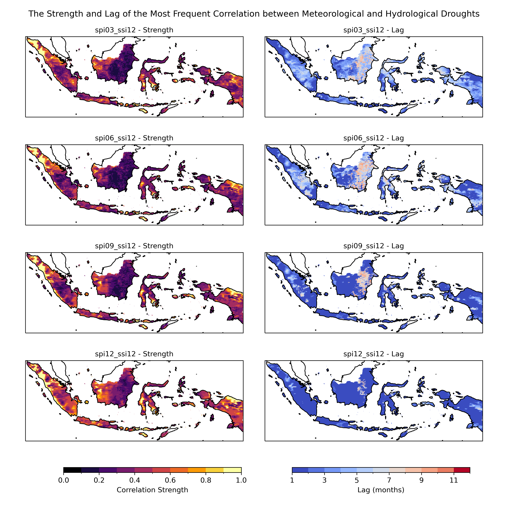
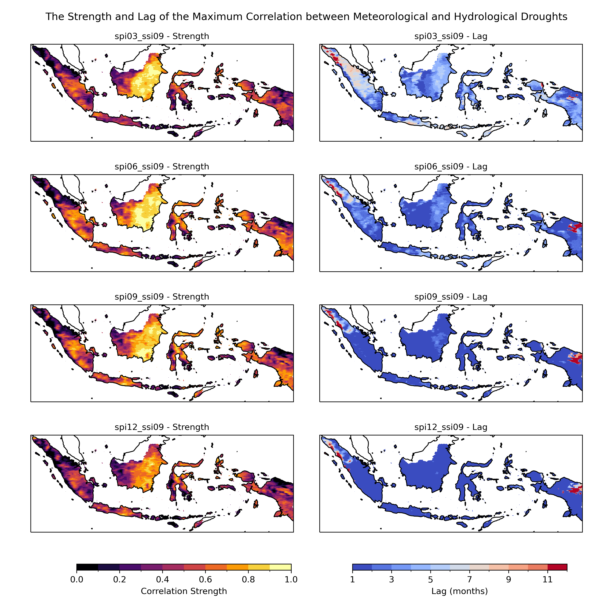

# Drought propagation

This repo contain notebook to analyze the propagation of **Meteorological Drought** (Standardized Precipitation Index - SPI) to **Hydrological Drought** (Standardized Streamflow Index - SSI) using **Lagged Correlation** at the pixel level with area of interest is Indonesia.

## Data

I use the **Standardized Precipitation Index** ([SPI](https://library.wmo.int/viewer/39629/download?file=wmo_1090_en.pdf&type=pdf&navigator=1)) - as proxy for meteorological drought, and the ([SSI](https://doi.org/10.1029/2019WR026315) - as proxy for hydrological drought. 

The SPI use monthly gridded Satellite precipitation estimates from Climate Hazards Group InfraRed Precipitation with Station data ([CHIRPS](https://doi.org/10.1038/sdata.2015.66)). 

The SSI use daily gridded River discharge in the last 24 hours from [GloFAS-ERA5 operational global river discharge reanalysis 1979–present](https://doi.org/10.5194/essd-12-2043-2020) as a proxy for the streamflow time series infomation.

## Folder structure and files

There are 3 notebook along with support folder that required to run the analysis. Feel free to use your own preferences for this setting/folder arrangements.

1. `hyd` # Files required to proceed the hydrological drought goes here.
2. `met` # Files required to proceed the meteorological drought goes here.
3. `prop` # File required to proceed the propagation using lagged correlation goes here.
4. `subset` # In this folder I put `idn_subset_chirps.nc` file, a subset file to clip the input data to follow the area of interest. Basically this file are came from a shapefile polygon which has `land` attribute column with `value = 1`, then converting to raster based on `land` column, and set the cell size following our standard (I use 0.05 deg, because the SPI and SSI also has the same spatial resolution, 0.05 deg). After that, convert it to netCDF. All is done in ArcGIS Desktop.

The notebook

5. [`1_Steps_to_Generate_SPI_Using_CHIRPS_Data.ipynb`](./1_Steps_to_Generate_SPI_Using_CHIRPS_Data.ipynb)
6. [`2_Steps_to_Generate_SSI_Using_GloFAS-ERA5_Data.ipynb`](./2_Steps_to_Generate_SSI_Using_GloFAS-ERA5_Data.ipynb)
7. [`3_Drought_Propagation_Met2Hyd_Using_CCA.ipynb`](./3_Drought_Propagation_Met2Hyd_Using_CCA.ipynb)

	This is using Cross-Correlation for each pixel accross the entire time series, also employ noise filtering techniques like Singular Spectrum Analysis (SSA) which can help in isolate the underlying trends and patterns in our data before performing the CCA. This step is crucial for enhancing the signal-to-noise ratio in our datasets. 

## Approach

The analysis using combination from various time scale [`3`, `6`, `9`, and `12-month`] and Lag range from 1 - 12 month

```python
time_scale_combinations = [
    "spi03_ssi03", "spi06_ssi03", "spi09_ssi03", "spi12_ssi03",
    "spi03_ssi06", "spi06_ssi06", "spi09_ssi06", "spi12_ssi06",
    "spi03_ssi09", "spi06_ssi09", "spi09_ssi09", "spi12_ssi09",
    "spi03_ssi12", "spi06_ssi12", "spi09_ssi12", "spi12_ssi12"
]
```

### Preprocessing

The drought characteristics originally following the method proposed by Yevjevich in [1967](https://www.engr.colostate.edu/ce/facultystaff/yevjevich/papers/HydrologyPapers_n23_1967.pdf) and has been employed to recognize the feature of droughts. The paper from Le, et al in [2019](https://www.researchgate.net/publication/333171255_Space-time_variability_of_drought_over_Vietnam) provide better explanation about it: duration, severity, intensity, and interarrival.


**Masking for Drought Event** The drought condition is set when the SPI or SSI value negative, or less than -1.2. Focusing on drought conditions could be a more relevant approach for our analysis compare to using all SPI and SSI data, as it has dry and wet condition. By concentrating on these periods, we can potentially gain more insight into the correlation between meteorological and hydrological droughts.

**Calculate Drought Magnitude** Compute the absolute cumulative values during drought events for both datasets. This gives a measure of drought magnitude, which may be more meaningful for correlation analysis than using raw SPI/SSI values.

**Applying Singular Spectrum Analysis (SSA)** For noise filtering and trend extraction in drought magnitude data in SPI and SSI datasets. In drought propagation analysis, noise filtering with SSA is a critical step for data preparation. SSA effectively separates the underlying signal from the noise in climate datasets, such as SPI and SSI. 

SSA decomposes a time series into a sum of components:

`X(t) = T(t) + S(t) + N(t)`

Where: </br>
* `X(t)`: Original time series
* `T(t)`: Trend component
* `S(t)`: Seasonal component
* `N(t)`: Noise component

This process is crucial for enhancing the clarity and accuracy of the data, which in turn facilitates a more precise understanding of drought patterns and their progression.

### Analysis

**Cross-Correlation Analysis** Especially when applied to data refined through SSA noise filtering, is pivotal in understanding drought propagation. This technique examines the relationship between different drought indicators across various time scales. By utilizing data filtered through SSA, which isolates the core signal from noise, Cross-Correlation Analysis can more accurately determine the time lag and intensity with which meteorological droughts (indicated by SPI) translate into hydrological droughts (indicated by SSI). 

The cross-correlation coefficient `(ρxy(τ))` at `lag τ` is calculated as:

`ρxy(τ) = ∑((Xi - X̄)(Yi+τ - Ȳ)) / √( ∑(Xi - X̄)2 ∑(Yi - Ȳ)2 )`

where:</br>
* `Xi`: Value of the first time series at time `i`
* `Yi`: Value of the second time series at time `i + τ`
* `τ`: Time lag
* `X̄`: Mean of the first time series
* `Ȳ`: Mean of the second time series
* `N`: Number of data points

This approach is essential for predicting the onset and progression of drought conditions, enabling timely decision-making and effective resource management to mitigate the adverse impacts of droughts.

**Frequency Analysis** In the context of drought propagation analysis, frequency analysis plays a critical role in identifying the most prominent patterns of correlation between meteorological and hydrological drought indicators over time. By classifying cross-correlation values into distinct ranges (e.g., 0.0-0.1, 0.1-0.2, etc.) and analyzing these across different lag times, researchers can pinpoint the range that most frequently occurs.

This approach helps in understanding the typical strength of correlation and the temporal shift (lag) between the onset of meteorological drought and its subsequent impact on hydrological conditions. The most frequent range provides insights into the commonality of correlation strengths, while the corresponding lag sheds light on the typical delay between atmospheric changes and their effects on hydrological systems. We can also derive the maximum correlation value that can provides insight on which areas has the best correlation, and Lag time where the maximum correlation between SPI and SSI is observed.

## Visualisation

There are two map type that use to  illustrate the results of the cross-correlation analysis between meteorological and hydrological droughts.

**Lag Map** This map displays the time lag (in months) between meteorological and hydrological droughts across the study area. It helps identify regions where hydrological responses to meteorological changes are immediate or delayed.

**Strength Map** This map shows the strength of the correlation between meteorological and hydrological droughts. It highlights areas with a strong predictive relationship, indicating regions sensitive to meteorological changes.

Below some example of the individual Strength Map from various time scale combinations and lag.

1. SPI 03 and SSI 03, Lag 1-month

	

2. SPI 06 and SSI 03, Lag 1-month

	

3. SPI 06 and SSI 03, Lag 3-month

	

4. SPI 12 and SSI 06, Lag 6-month

	

And below some example of the composite Strength and Lag Map from various time scale combinations.

1. Most frequent correlation and Lag where the most frequent observe of SPI to SSI 3-month

	

2. Most frequent correlation and Lag where the most frequent observe of SPI to SSI 6-month

	

3. Most frequent correlation and Lag where the most frequent observe of SPI to SSI 9-month

	

4. Most frequent correlation and Lag where the most frequent observe of SPI to SSI 12-month

	

5. Maximum correlation and Lag where the maximum observe of SPI to SSI 3-month

	

6. Maximum correlation and Lag where the maximum observe of SPI to SSI 6-month

	

7. Maximum correlation and Lag where the maximum observe of SPI to SSI 9-month

	

8. Maximum correlation and Lag where the maximum observe of SPI to SSI 12-month

	

## To do

Number of Lag from 1-12 month in the existing simulation is good enough. 

Adding more time scale from `3, 6, 9, 12` to `1, 2, 3, 4, 5, 6, 7, 8, 9, 10, 11, 12` and the combination, potentially produce more insight.

---

This step-by-step guide was tested using Windows 11 with WSL2 - Ubuntu 22 enabled running on Thinkpad T480 2019, i7-8650U 1.9GHz, 64 GB 2400 MHz DDR4.

**WORK IN PROGRESS**
